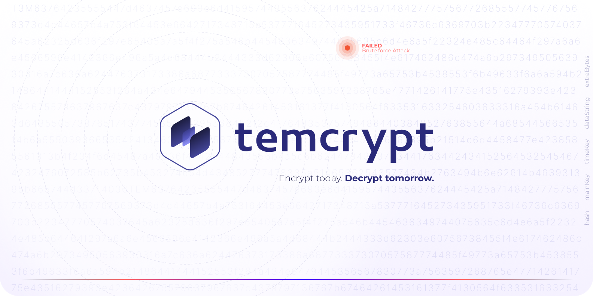

<h3>The Next-gen Encryption</h3>
<a href="https://temcrypt.io">Try temcrypt on the Web →</a>
<br/>

# temcrypt SDK
Focused on protecting highly sensitive data, temcrypt is an advanced multi-layer data evolutionary encryption mechanism that offers scalable complexity over time, and is resistant to common brute force attacks.

> You can create your own applications, scripts and automations when
> deploying it.

## Knowledge
Find out what **temcrypt** stands for, the features and inspiration that led me to create it and much more. [**READ THE KNOWLEDGE DOCUMENT**](KNOWLEDGE.md). This is very important to you.

## Compatibility
temcrypt is compatible with both Node.js v18 or major, and modern web browsers, allowing you to use it in various environments.

## Getting Started
The only dependencies that temcrypt uses are `crypto-js` for handling encryption algorithms like **AES-256**, **SHA-256** and some encoders and `fs` is used for file handling with Node.js

To use temcrypt, you need to have **[Node.js](https://nodejs.org/)** installed. Then, you can install temcrypt using npm:

```shell
npm install temcrypt
```
after that, import it in your code as follows:
```js
const temcrypt = require("temcrypt");
```
Includes an **auto-install** feature for its dependencies, so you don't have to worry about installing them manually. Just run the `temcrypt.js` library and the dependencies will be installed automatically and then call it in your code, this was done to be portable:

```shell
node temcrypt.js
```
Alternatively, you can use temcrypt directly in the browser by including the following script tag:
```html
<script src="temcrypt.js"></script>
```
or minified:
```html
<script src="temcrypt.min.js"></script>
```
You can also call the library on your website or web application from a **CDN**:
```html
<script src="https://cdn.jsdelivr.net/gh/jofpin/temcrypt/temcrypt.min.js"></script>
```

## Usage

#### ENCRYPT & DECRYPT
temcrypt provides functions like `encrypt` and `decrypt` to securely protect and disclose your information.

**Parameters**
-   `dataString` (**string**): The string data to encrypt.
-   `dataFiles` (**string**): The file path to encrypt. Provide either `dataString` or `dataFiles`.
-   `mainKey` (**string**): The main key (private) for encryption.
-   `extraBytes` (**number**, **optional**): Additional bytes to add to the encryption. Is an optional parameter used in the temcrypt encryption process. It allows you to add extra bytes to the encrypted data, increasing the complexity of the encryption, which requires more processing power to decrypt. *It also serves to make patterns lose by changing the weight of the encryption.*

**Returns**
-   If successful:
    -   `status` (**boolean**): `true` to indicate successful decryption.
    -   `hash` (**string**): The unique hash generated for the legitimacy verify of the encrypted data.
    -   `dataString` (**string**) or `dataFiles`: The decrypted string or the file path of the decrypted file, depending on the input.
    -   `updatedEncryptedData` (**string**): The updated encrypted data after decryption. The updated encrypted data after decryption. Every time the encryption is decrypted, the output is updated, because the mainKey changes its order and the new date of last decryption is saved.
    -   `creationDate` (**string**): The creation date of the encrypted data.
    -   `lastDecryptionDate` (**string**): The date of the last successful decryption of the data.
-   If `dataString` is provided:
    -   `hash` (**string**): The unique hash generated for the legitimacy verify of the encrypted data.
    -   `mainKey` (**string**): The main key (private) used for encryption.
    -   `timeKey` (**string**): The time key (private) of the encryption.
    -   `dataString` (**string**): The encrypted string.
    -   `extraBytes` (**number**, **optional**): The extra bytes used for encryption.
-   If `dataFiles` is provided:
    -   `hash` (**string**): The unique hash generated for the legitimacy verify of the encrypted data.
    -   `mainKey` (**string**): The main key used for encryption.
    -   `timeKey` (**string**): The time key of the encryption.
    -   `dataFiles` (**string**): The file path of the encrypted file.
    -   `extraBytes` (**number**, **optional**): The extra bytes used for encryption.
-   If decryption fails:
    -   `status` (**boolean**): `false` to indicate decryption failure.
    -   `error_code` (**number**): An error code indicating the reason for decryption failure.
    -   `message` (**string**): A descriptive error message explaining the decryption failure.

Here are some examples of how to use temcrypt. Please note that when encrypting, you must enter a key and save the hour and minute that you encrypted the information. To decrypt the information, you must use the same main key at the same hour and minute on subsequent days:

#### Encrypt a String
```js
const dataToEncrypt = "Sensitive data";
const mainKey = "your_secret_key"; // Insert your custom key

const encryptedData = temcrypt.encrypt({
  dataString: dataToEncrypt,
  mainKey: mainKey
});

console.log(encryptedData);
```
#### Decrypt a String
```js
const encryptedData = "..."; // Encrypted data obtained from the encryption process
const mainKey = "your_secret_key";

const decryptedData = temcrypt.decrypt({
  dataString: encryptedData,
  mainKey: mainKey
});

console.log(decryptedData);
```

**Encrypt a File:**

To encrypt a file using temcrypt, you can use the `encrypt` function with the `dataFiles` parameter. Here's an example of how to encrypt a file and obtain the encryption result:
```js
const temcrypt = require("temcrypt");

const filePath = "path/test.txt";
const mainKey = "your_secret_key";

const result = temcrypt.encrypt({
  dataFiles: filePath,
  mainKey: mainKey,
  extraBytes: 128 // Optional: Add 128 extra bytes
});

console.log(result);
```
In this example, replace `'test.txt'` with the actual path to the file you want to encrypt and set `'your_secret_key'` as the main key for the encryption. The `result` object will contain the encryption details, including the unique hash, main key, time key, and the file path of the encrypted file.

**Decrypt a File:**

To decrypt a file that was previously encrypted with temcrypt, you can use the `decrypt` function with the `dataFiles` parameter. Here's an example of how to decrypt a file and obtain the decryption result:
```js
const temcrypt = require("temcrypt");

const filePath = "path/test.txt.trypt";
const mainKey = "your_secret_key";

const result = temcrypt.decrypt({
  dataFiles: filePath,
  mainKey: mainKey
});

console.log(result);
```
In this example, replace `'path/test.txt.trypt'` with the actual path to the encrypted file, and set `'your_secret_key'` as the main key for decryption. The result object will contain the decryption status and the decrypted data, if successful.

Remember to provide the correct main key used during encryption to successfully decrypt the file, at the exact same hour and minute that it was encrypted. If the main key is wrong or the file was tampered with or the time is wrong, the decryption status will be `false` and the decrypted data will not be available.

---
#### UTILS
temcrypt provides `utils` functions to perform additional operations beyond encryption and decryption. These utility functions are designed to enhance the functionality and usability.

**Function List:**
1.  **changeKey:** Change your encryption mainKey
2.  **check:** Check if the encryption belongs to temcrypt
3.  **verify:** Checks if a hash matches the legitimacy of the encrypted output.

Below, you can see the details and how to implement its uses.

**Update MainKey:**

The `changeKey` utility function allows you to change the mainKey used to encrypt the data while keeping the encrypted data intact. This is useful when you want to enhance the security of your encrypted data or update the mainKey periodically.

#### Parameters

-   `dataFiles` (**optional)**: The path to the file that was encrypted using temcrypt.
-   `dataString` (**optional**): The encrypted string that was generated using temcrypt.
-   `mainKey` (**string**): The current mainKey used to encrypt the data.
-   `newKey`(**string**): The new mainKey that will replace the current mainKey.

```js
const temcrypt = require("temcrypt");

const filePath = "test.txt.trypt";
const currentMainKey = "my_recent_secret_key";
const newMainKey = "new_recent_secret_key";

// Update mainKey for the encrypted file
const result = temcrypt.utils({
  changeKey: {
    dataFiles: filePath,
    mainKey: currentMainKey,
    newKey: newMainKey
  }
});

console.log(result.message);
```

**Check Data Integrity:**

The `check` utility function allows you to verify the integrity of the data encrypted using temcrypt. It checks whether a file or a string is a valid temcrypt encrypted data.

#### Parameters

-   `dataFiles` (**optional**): The path to the file that you want to check.
-   `dataString` (**optional**): The encrypted string that you want to check.

```js
const temcrypt = require("temcrypt");

const filePath = "test.txt.trypt";
const encryptedString = "..."; // Encrypted string generated by temcrypt

// Check the integrity of the encrypted File
const result = temcrypt.utils({
  check: {
    dataFiles: filePath
  }
});

console.log(result.message);

// Check the integrity of the encrypted String
const result2 = temcrypt.utils({
  check: {
    dataString: encryptedString
  }
});

console.log(result2.message);
```

**Verify Hash:**

The `verify` utility function allows you to verify the integrity of encrypted data using its hash value. Checks if the encrypted data output matches the provided hash value.

#### Parameters

-   `hash` (**string**): The hash value to verify against.
-   `dataFiles` (**optional**): The path to the file whose hash you want to verify.
-   `dataString` (**optional**): The encrypted string whose hash you want to verify.

```js
const temcrypt = require("temcrypt");

const filePath = "test.txt.trypt";
const hashToVerify = "..."; // The hash value to verify

// Verify the hash of the encrypted File
const result = temcrypt.utils({
  verify: {
    hash: hashToVerify,
    dataFiles: filePath
  }
});

console.log(result.message);

// Verify the hash of the encrypted String
const result2 = temcrypt.utils({
  verify: {
    hash: hashToVerify,
    dataString: encryptedString
  }
});

console.log(result2.message);
```
## Error Codes

The following table presents the important error codes and their corresponding error messages used by temcrypt to indicate various error scenarios.

|  Code      | Error Message                                       | Description                                                      |
|------------|-----------------------------------------------------|------------------------------------------------------------------|
| 420        | Decryption time limit exceeded                      | The decryption process took longer than the allowed time limit. |
| 444        | Decryption failed                                   | The decryption process encountered an error.                    |
| 777        | No data provided                                    | No data was provided for the operation.                         |
| 859        | Invalid temcrypt encrypted string                   | The provided string is not a valid temcrypt encrypted string.   |


## Examples

Check out the [examples](examples) directory for more detailed usage examples.

> #### ⚠️ **RECOMMENDATION**
> The encryption size of a string or file should be less than **16 KB (kilobytes)**. If
> it's larger, you must have enough computational power to decrypt it.
> Otherwise, your personal computer will exceed the time required to
> find the correct main key combination and proper encryption formation,
> and it won't be able to decrypt the information.

> #### ℹ️ **TIPS**
> 1. With temcrypt you can only decrypt your information in later days with the key that you entered at the same hour and minute that you encrypted.
> 2. Focus on time, it is recommended to start the decryption between the first 2 to 10 seconds, so you have an advantage to generate the correct key formation.

## License

The content of this project itself is licensed under the [Creative Commons Attribution 3.0 license](http://creativecommons.org/licenses/by/3.0/us/deed.en_US), and the underlying source code used to format and display that content is licensed under the [MIT license](LICENSE).

Copyright (c) 2023 by [**Jose Pino**](https://x.com/jofpin)
